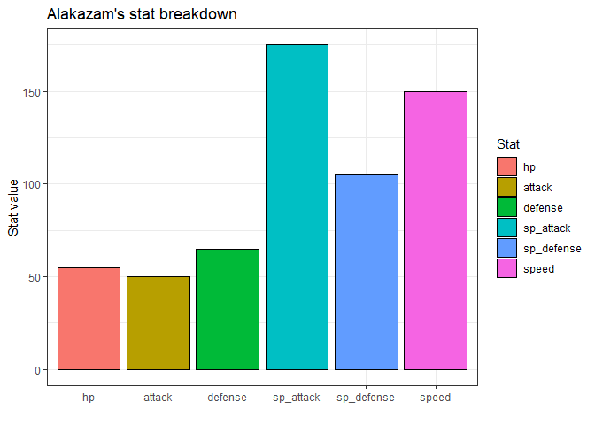
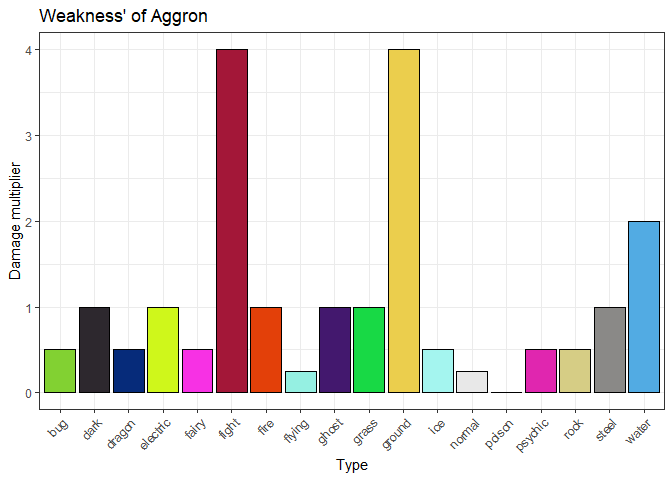

<!-- README.md is generated from README.Rmd. Please edit that file -->

# PokemonAnalyse

<!-- badges: start -->
<!-- badges: end -->

The goal of PokemonAnalyse is to make analysing the “Pokemon” dataset
easier

## Installation

You can install the development version of PokemonAnalyse from
[GitHub](https://github.com/) with:

``` r
# install.packages("devtools")
devtools::install_github("PedroDeBos/PokemonAnalyse")
```

## Functions

This package includes 4 functions, which will all be shown including
examples below. Important is that all functions rely on the pokemon’s
name being spelled with a **capital letter**

**pokemon_legendary**: States whether the selected pokemon is legendary
or not

``` r
library(PokemonAnalyse)
pokemon_legendary("Mewtwo")
#> [1] "Mewtwo is a legendary pokemon"
pokemon_legendary("Charizard")
#> [1] "Charizard is not a legendary pokemon"
```

**pokemon_type**: States the type(s) of the selected pokemon

``` r
pokemon_type("Groudon")
#> $Groudon
#> [1] "Groudon is a ground type"
pokemon_type("Gengar")
#> $Gengar
#> [1] "Gengar is a ghost and a poison type"
```

**pokemon_stats**: Gives a graph of the selected pokemon’s stats

``` r
pokemon_stats("Alakazam")
```



**pokemon_weakness**: Gives a graph of the selected pokemon’s weakness’

``` r
pokemon_weakness("Aggron")
```



## Credits

Pokemon database was taken from Rounak Banik’s
[kaggle.com](https://www.kaggle.com/datasets/rounakbanik/pokemon) under
the CC0 license

Functions were written by Pedro de Bos
